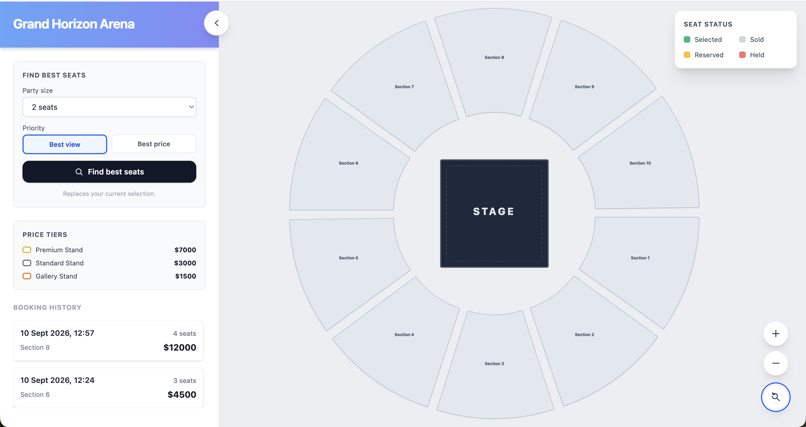
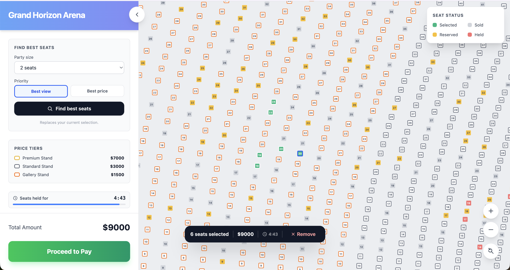
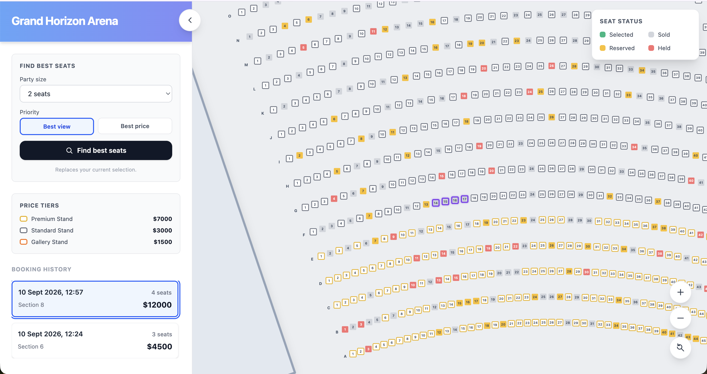
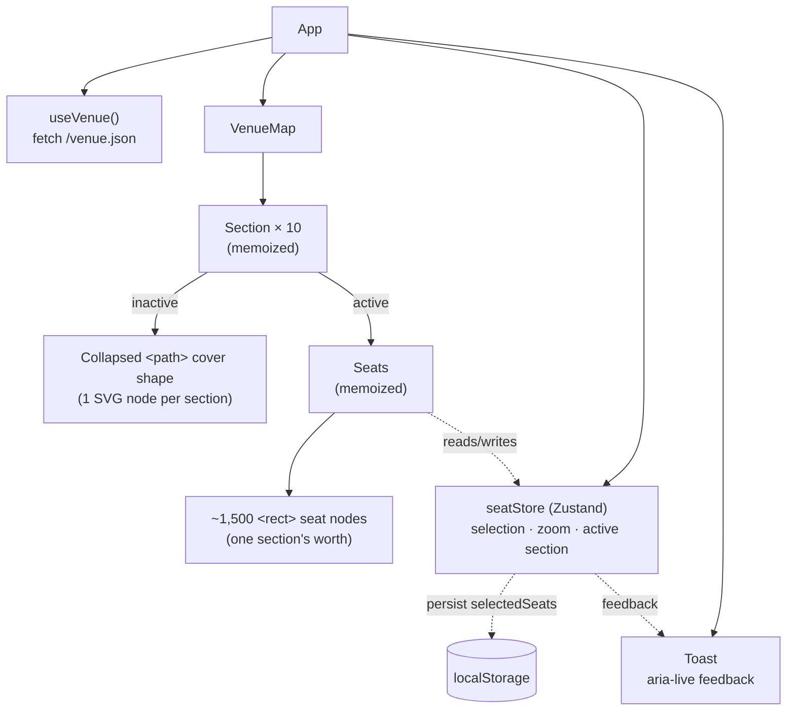

# Event Seating Map

[](https://nodejs.org)
[](https://react.dev)
[](https://pnpm.io)

A high-performance, interactive seating map for large venues, built to handle **15,000+ seats**
with smooth panning, zooming, keyboard navigation, and persisted selection - without shipping a
canvas/WebGL engine or a virtualization library.

---

## 🎯 Problem statement

A venue booking UI has to render every seat in a venue (this project's sample data: 10 sections ×
30 rows × 50 seats = **15,000 seats**) as an individually selectable, keyboard-navigable element,
while staying responsive to pan, zoom, and selection changes. Rendering 15,000 live SVG nodes at
once is the naive approach - and it's slow: every zoom/selection change forces the browser to
diff, layout, and paint tens of thousands of DOM nodes. This project's core engineering problem is
keeping the map interactive at that scale using nothing heavier than React + SVG.

## 📸 Screenshots

**Overview** - the full venue map with all 10 sections collapsed, and the Booking History sidebar
in its default state.



**Section drill-in & seat selection** - every seat status (available, selected, sold, reserved,
held) visible at once, with the live selected-seats list and running total in the sidebar.



**Booking History** - completed purchases are grouped and listed; clicking one highlights its
exact seats back on the map.



---

## 🏗️ Architecture & performance



### 15,000+ seat rendering: section-level collapsing

The map never mounts all 15,000 seats as DOM nodes at once. [`Section.tsx`](src/components/Section.tsx)
renders each **inactive** section as a single collapsed `<path>` "cover" shape traced around its
outer row (one SVG node, regardless of how many seats it contains). Only the **one active**
section (the one the user clicked into) mounts individual seat `<rect>` nodes via
[`Seat.tsx`](src/components/Seat.tsx). That caps live, interactive seat nodes at ~1,500 (one
section) instead of 15,000, at any given time.

This is a deliberate alternative to two heavier options:

- **Canvas/WebGL**: gives raw rendering throughput but throws away native SVG accessibility
  (focus, `role`, `aria-*`) and hit-testing - you'd have to reimplement both by hand.
- **Row/column virtualization** (`react-window`/`react-virtualized`): built for linear lists, not
  an SVG coordinate space with seats laid out on radial rows. Section-level collapsing matches this
  venue's natural UX unit (users think in sections, not in a scrollable seat list) and needs no
  extra dependency.

`Section` and `Seats` are both `React.memo`-wrapped, so panning, zooming, or selecting a seat in
one section doesn't force every other (already-collapsed) section to re-render or recompute its
cover path.

### Zustand persistence strategy

Selected seats survive a page refresh via Zustand's `persist` middleware - but `selectedSeats` is
a `Set<string>`, and `JSON.stringify` can't round-trip a `Set` on its own. [`seatStore.ts`](src/store/seatStore.ts)
supplies a custom `PersistStorage` that serializes `Set<string> ↔ string[]` on `getItem`/`setItem`,
so `localStorage` only ever stores an array, while the in-memory store keeps `O(1)` `has()`/`add()`/
`delete()` lookups for selection toggling. `partialize` scopes persistence to `selectedSeats` only -
`zoom`, `activeSectionId`, and transient `feedback` state are intentionally not persisted.

See [`docs/engineering-notes.md`](docs/engineering-notes.md) for the tradeoffs behind these
decisions and where they'd need to change at greater scale.

---

## ♿ Accessibility

- Every seat is a real interactive element: `role="checkbox"`, `aria-checked` reflecting selection,
  `aria-label` describing row/seat/price/status, and `aria-disabled` for sold/reserved/held seats.
- **Roving keyboard navigation**: only the active section's seats are focusable (`tabIndex={0}`,
  or `-1` when unavailable). Arrow keys move focus seat-to-seat - `ArrowLeft`/`ArrowRight` within a
  row, `ArrowUp`/`ArrowDown` to the nearest seat (by x-position) in the adjacent row - and
  `Enter`/`Space` toggle selection, matching native checkbox semantics.
- Feedback that used to be a blocking `alert()` (hitting the 8-seat cap, the payment stub) is now
  an `aria-live="polite"` [`Toast`](src/components/Toast.tsx) region and inline confirmation state,
  so screen readers announce it without interrupting keyboard flow.

---

## 🚀 Features

- **Large-scale rendering**: Thousands of seats render smoothly using SVG optimization.
- **Map navigation**: Click-and-drag panning with smart zoom in/out controls.
- **Accessibility**: Full arrow-key navigation between seats, keyboard-selectable seats (`role="checkbox"`).
- **Persisted selection**: Selected seats survive a page refresh (Zustand + `localStorage`).
- **Responsive layout**: A collapsible booking sidebar on mobile, side-by-side on desktop.

---

## 🛠️ Tech Stack

### Application

- **Core**: React 19, TypeScript
- **State Management**: Zustand (with persisted seat selection)
- **Styling**: Tailwind CSS
- **Build Tool**: Vite

### Engineering standards & tooling

- **Testing**: Vitest + Testing Library (jsdom)
- **Linting/Formatting**: ESLint (React, hooks, jsx-a11y, strict + stylistic type-checked
  TypeScript rules) + Prettier
- **Git hooks**: Husky (`pre-commit` → Gitleaks + lint-staged + full quality check + production
  build, `commit-msg` → commitlint)
- **Commit convention**: Conventional Commits, enforced by commitlint
- **Secret scanning**: Gitleaks (local pre-commit + full-history scan in CI)
- **CI**: GitHub Actions (`secret-scan`, `dependency-audit`, `quality`, `commitlint`, `test`, `build`)

See [Engineering standards](#-engineering-standards) below for details.

---

## 📂 Repository Structure

```text
├── docs/
│   ├── engineering-notes.md              # Tradeoffs, performance bottlenecks, known gaps
│   ├── ui-ux-and-business-logic-flow.md  # UI state/interaction reference
│   └── screenshots/                      # README screenshots
├── public/
│   ├── venue.json    # Generated seating data served to the client
│   ├── robots.txt
│   └── llms.txt
├── scripts/
│   └── generateVenue.ts     # Generates public/venue.json
├── src/
│   ├── components/    # VenueMap, Section, Seat, BookingSummary, SeatSelectionPanel,
│   │                   # SeatSelectionFooter, BookingHistoryPanel, ConfirmDialog, Toast,
│   │                   # Icon, IconButton
│   ├── hooks/
│   │   └── useVenue.ts       # Fetches and validates public/venue.json
│   ├── store/
│   │   └── seatStore.ts      # Zustand store (zoom, active section, selection, sold seats,
│   │                          # booking history, feedback)
│   ├── interfaces/
│   │   └── venue.interfaces.ts
│   ├── utils/         # rowLetter, seatIndex, venueBounds, viewTransform (pan/zoom math)
│   ├── test/
│   │   └── setup.ts          # Vitest + Testing Library setup
│   ├── App.tsx
│   └── main.tsx
├── .github/workflows/ci.yml  # CI pipeline
├── .husky/                   # pre-commit / commit-msg hooks
├── .nvmrc / .npmrc           # Node/pnpm version + install policy
└── README.md
```

---

## ⚙️ Getting Started

### Prerequisites

- **Node.js** `>=24 <25` (see `.nvmrc` / `engines` in `package.json`)
- **pnpm 11.x** (this project uses pnpm, not npm/yarn - pinned exactly via the `packageManager`
  field in `package.json`; `.npmrc` sets `engine-strict=true` so installs fail fast on a
  mismatched Node/pnpm version instead of silently drifting)
- **Gitleaks v8.30.1** on `PATH` - required by the pre-commit hook (see [Secret scanning](#secret-scanning-gitleaks))

### Installation & Setup

1. **Clone the repository**

   ```bash
   git clone git@github.com:webvoltz/Interactive-Event-Seating-Map.git
   cd Interactive-Event-Seating-Map
   ```

2. **Install dependencies**

   ```bash
   pnpm install
   ```

3. **Install the Husky git hooks** (one-time, after cloning)

   ```bash
   pnpm run prepare
   ```

### Running Locally

```bash
pnpm dev
```

The app expects seat data at `public/venue.json`; a sample file is already checked in. Regenerate it any time with:

```bash
pnpm run generate:venue
```

### Running a Production Build

```bash
pnpm run build
pnpm start
```

`pnpm start` (an alias for `vite preview`) serves the `dist/` output from `pnpm run build` - use it
to sanity-check the actual production bundle, or to satisfy hosting platforms that expect a
`start` script.

---

## 🔒 Environment Variables

There are **no environment variables** - seating data is served from the static `public/venue.json`, not an API. If a real backend is introduced later, add a Zod-validated env module rather than reading `import.meta.env` directly in components.

---

## 🧪 Running Tests

```bash
pnpm test
```

Runs with V8 coverage enabled (`pnpm run security:audit` covers dependency vulnerabilities
separately). Coverage thresholds in [`vite.config.ts`](vite.config.ts) are set to today's actual
numbers as a regression floor, not the org standard's targets (branches 85% / functions 100% /
lines 90% / statements 90%) - most components don't have tests yet; see
[`docs/engineering-notes.md`](docs/engineering-notes.md#known-remaining-gaps) for the honest
current numbers and what closing that gap actually requires.

Existing tests cover seat selection/deselection, the 8-seat selection cap, clearing the selection,
the persisted-seats/sold-seats/booking-history `localStorage` round trip, and keyboard navigation
(arrow keys, Enter/Space, skipping unavailable seats) - see
[`src/store/seatStore.test.ts`](src/store/seatStore.test.ts) and
[`src/components/Seat.test.tsx`](src/components/Seat.test.tsx). Pan/zoom math (fit-to-screen,
zoom-at-pointer, pan clamping) is covered separately in
[`src/utils/viewTransform.test.ts`](src/utils/viewTransform.test.ts).

---

## 📐 Engineering standards

This project follows the Webvoltz React engineering standards.

### Code quality

- **ESLint** (`eslint.config.js`) lints `.js/.jsx/.ts/.tsx` with `eslint-plugin-react`,
  `eslint-plugin-react-hooks`, `eslint-plugin-jsx-a11y`, and `typescript-eslint`'s
  `strictTypeChecked` + `stylisticTypeChecked` rule sets - `no-explicit-any`, every `no-unsafe-*`
  rule, `only-throw-error`, `require-await`, `switch-exhaustiveness-check`, `ban-ts-comment`
  (`@ts-expect-error` requires a real description), and `consistent-type-imports` are all errors,
  not warnings. `restrict-template-expressions` allows `number` (seat coordinates/prices are
  legitimately interpolated) but still disallows objects/`null`/`undefined`. `pnpm run lint` fails
  on any warning (`--max-warnings=0`).
- **Prettier** (`.prettierrc.json`) is the single source of formatting truth. Run
  `pnpm run format`, or let the pre-commit hook format staged files for you.
- **TypeScript** runs in strict mode plus `noUncheckedIndexedAccess`, `exactOptionalPropertyTypes`,
  `noImplicitReturns`, `noImplicitOverride`, `noPropertyAccessFromIndexSignature`,
  `forceConsistentCasingInFileNames`, `allowUnreachableCode: false`, and `allowUnusedLabels: false`,
  guarding indexed access explicitly instead of asserting it away. `skipLibCheck` stays `true`
  (rather than the standard's `false`) as a documented exception: flipping it surfaces type
  conflicts inside vitest/vite/testing-library's own bundled declarations, not this project's own
  code (see the comment in `tsconfig.app.json`).
- `pnpm run quality` runs format-check, lint, and typecheck together - this is what CI runs, and
  what the pre-commit hook runs on the whole project (not just staged files) before every commit.
- `pnpm run security:audit` runs `pnpm audit --audit-level high` for dependency vulnerabilities.

### Git hooks (Husky)

Installed via `pnpm run prepare`. Two hooks live in `.husky/`:

- **`pre-commit`** - in order: scans the staged diff with Gitleaks, runs `lint-staged`
  (ESLint `--fix` + Prettier) on the files you're committing, then `pnpm run quality` and
  `pnpm run build` against the **whole project** (not just staged files) - a broken build or a
  type error anywhere blocks the commit, even in a file you didn't touch.
- **`commit-msg`** - runs `commitlint` against your commit message.

Don't bypass either hook with `--no-verify` to get past a genuine failure - fix the issue instead.

### Commit messages

Commit messages follow [Conventional Commits](https://www.conventionalcommits.org/), checked by `commitlint.config.cjs`:

- Header, body, and footer lines must each be ≤ 1000 characters - room to actually explain
  yourself, not the old 72/100-character convention that just trains people to write useless
  messages to fit.
- `type` must be one of: `build`, `chore`, `ci`, `docs`, `feat`, `fix`, `perf`, `refactor`, `revert`, `style`, `test`.

Example: `fix: prevent seat selection past the 8-seat limit`

### Secret scanning (Gitleaks)

The pre-commit hook requires the `gitleaks` binary on `PATH` and **fails closed** if it's missing:

1. Download [Gitleaks v8.30.1](https://github.com/gitleaks/gitleaks/releases/tag/v8.30.1) for your platform.
2. Verify it per your usual tooling-verification process and put the `gitleaks` executable on `PATH`.
3. Confirm `gitleaks version` works.

GitHub Actions independently re-scans full repository history with the same pinned version, so a bypassed local hook is still caught in CI.

**False positives:** investigate every finding first. Only add a narrowly scoped exception in `.gitleaks.toml` after a real secret has been ruled out, with a comment explaining why - never a blanket allowlist - and re-run the scan afterward.

### Continuous integration

`.github/workflows/ci.yml` runs on every push and pull request, gated in stages via `needs`:

| Job                | Needs                             | What it does                                                                   |
| ------------------ | --------------------------------- | ------------------------------------------------------------------------------ |
| `secret-scan`      | -                                 | Gitleaks over full repository history.                                         |
| `dependency-audit` | -                                 | `pnpm run security:audit` (`pnpm audit --audit-level high`).                   |
| `quality`          | `secret-scan`, `dependency-audit` | `pnpm run quality` (format check, lint, typecheck).                            |
| `commitlint`       | `secret-scan`, `dependency-audit` | Lints the commit range being pushed/merged.                                    |
| `test`             | `quality`, `commitlint`           | `pnpm test` (V8 coverage, checked against the thresholds in `vite.config.ts`). |
| `build`            | `test`                            | `pnpm run build`.                                                              |

All jobs must pass before merging.

---

## 🤝 Contributing

1. Fork or branch from `main`.
2. Create your feature branch (`git checkout -b feature/amazing-feature`).
3. Commit your changes following the [commit convention](#commit-messages) (`git commit -m 'feat: add amazing feature'`).
4. Run `pnpm run quality && pnpm test && pnpm run build` before pushing.
5. Push to the branch and open a pull request.
