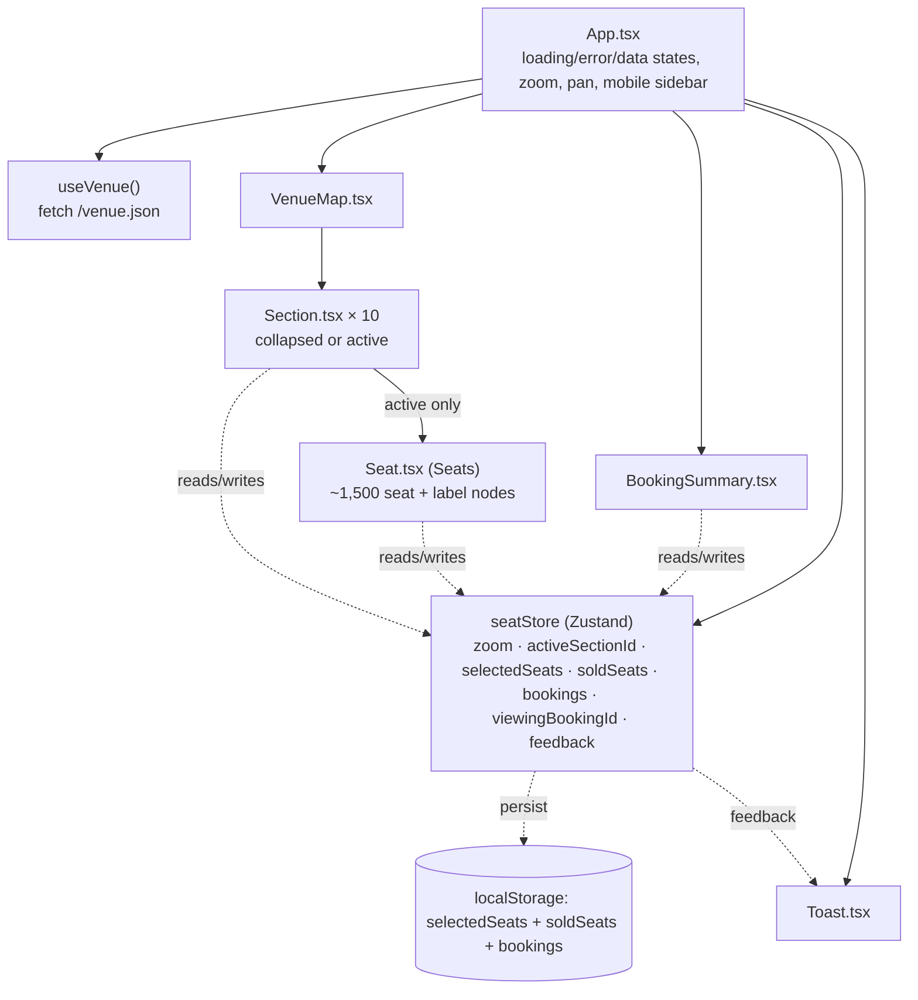

# UI/UX & Business Logic - Technical Flow

This document walks through **exactly how the current codebase behaves**, end to end: every UI
state, every interaction, and every business rule, with the file/line it lives in. It complements
[`README.md`](../README.md) (project overview, setup) and
[`engineering-notes.md`](engineering-notes.md) (performance tradeoffs) - this file is the "what
happens when you click X" reference.

---

## 1. Architecture at a glance



Single-page app, no router. `App.tsx` owns page-level UI state (loading/error, mobile sidebar,
mouse-drag panning); `seatStore` (Zustand) owns cross-component venue state (zoom, which section is
open, which seats are selected/sold, transient toast feedback).

---

## 2. Data model

[`venue.interfaces.ts`](../src/interfaces/venue.interfaces.ts):

```ts
SeatStatus = 'available' | 'reserved' | 'sold' | 'held'
ISeat   = { id, col, x, y, priceTier, status }
Row     = { index, seats: ISeat[] }
Section = { id, label, transform, rows: Row[] }
Venue   = { venueId, name, map: { width, height }, sections: Section[] }
```

Generated once by [`scripts/generateVenue.ts`](../scripts/generateVenue.ts) into
`public/venue.json`: **10 sections × 30 rows × 50 seats = 15,000 seats**, arranged radially around
a 2400×2400 coordinate space. Price tier by row index: rows 0–4 → tier 1 (front, priciest), 5–14 →
tier 2, 15–29 → tier 3 (back, cheapest). `status` is seeded per seat (~70% `available`, ~15%
`sold`, ~10% `reserved`, ~5% `held` - see §14) rather than uniformly `available`.

`x`/`y` per seat are pre-computed polar coordinates (already resolved to cartesian) - no
trigonometry happens at render time, only at generation time.

---

## 3. State: `seatStore` ([`seatStore.ts`](../src/store/seatStore.ts))

| Field                | Type                      | Persisted?             | Set by                                                                                                                        |
| -------------------- | ------------------------- | ---------------------- | ----------------------------------------------------------------------------------------------------------------------------- |
| `zoom`               | `number`                  | ❌                     | fit-on-load effect, zoom buttons, section open/close, resume-selection effect                                                 |
| `activeSectionId`    | `string \| null`          | ❌                     | clicking/keying a section, clicking the empty map background, viewing a booking, `selectSeatBlock`                            |
| `selectedSeats`      | `Set<string>`             | ✅ (custom serializer) | `toggleSeat`, `selectSeatBlock`, `clearSelection`, `confirmPurchase` (empties it), a lost hold tie-break                      |
| `selectionExpiresAt` | `number \| null`          | ✅ (plain number)      | `toggleSeat` (first seat starts it), `selectSeatBlock`, cleared by `clearSelection`/`confirmPurchase`/expiry                  |
| `soldSeats`          | `Set<string>`             | ✅ (custom serializer) | `confirmPurchase` (adds the seats just paid for), a remote `sold` broadcast                                                   |
| `bookings`           | `Booking[]`               | ✅ (plain JSON)        | `confirmPurchase` (prepends the new booking; newest first)                                                                    |
| `viewingBookingId`   | `string \| null`          | ❌                     | `viewBooking`/`clearViewingBooking`, cleared by `toggleSeat`/`selectSeatBlock`                                                |
| `feedback`           | `{type, message} \| null` | ❌                     | `toggleSeat`/`selectSeatBlock` (max-seat cap), the best-seats finder, hold contention, cleared by `Toast` after 4s or dismiss |
| `holds`              | `Map<string, SeatHold>`   | ❌                     | `seedSimulation`, `setHolds`, `applyRemoteSold`, `runExpiry` (prunes lapsed entries)                                          |
| `simulationSeeded`   | `boolean`                 | ❌                     | `seedSimulation` (guards against seeding twice - e.g. a late cross-tab reply)                                                 |

**Persistence**: `partialize` scopes `localStorage` (`key: venue-storage`) to `selectedSeats`,
`soldSeats`, `bookings`, **and** `selectionExpiresAt`. Since `Set` isn't JSON-native, a custom
`PersistStorage` converts each `Set<string> ↔ string[]` on `getItem`/`setItem` (`bookings` is a
plain array of plain objects, so it round-trips through `JSON.stringify`/`parse` with no custom
conversion needed) - `zoom`, `activeSectionId`, `viewingBookingId`, `feedback`, `holds`, and
`simulationSeeded` are intentionally transient and reset on reload. `holds` in particular is
deliberately excluded even though it's meaningful state: it's time-based (a stale hold from last
session means nothing) and shared cross-tab via `BroadcastChannel`, so treating `localStorage` as a
second source of truth for it would fight that sync instead of complementing it. See
[`docs/engineering-notes.md`](engineering-notes.md#localstorage-persistence-limits).

**`toggleSeat(seatId)`** - the core selection rule:

```
if the seat has a live foreign hold → set feedback (error toast), no-op
else if already selected → remove it
else if selectedSeats.size >= MAX_SELECTABLE_SEATS (8) → set feedback (error toast), no-op
else → add it, and if this is the first seat, start selectionExpiresAt (now + 5 minutes)
```

Also always clears `viewingBookingId` - starting or editing a live selection supersedes browsing
past booking history, so the two sidebar modes (§8) never end up fighting over what the map should
show. Adding a second (or third, ...) seat does **not** push the deadline back - it's anchored to
when the cart was opened, matching how a real ticketing site's hold works. No server round-trip for
the sale itself, but see §15 for how holds now coordinate across tabs of the same browser.

**`selectSeatBlock(seatIds, sectionId)`** - the best-seats finder's entry point (§16): replaces
`selectedSeats` wholesale rather than merging, sets `activeSectionId` to the winning section in the
same update (so there's no intermediate render where the seats are selected but not yet mounted),
clears `viewingBookingId`, and starts a fresh `selectionExpiresAt`. Refuses (with the same cap
feedback `toggleSeat` uses) if given zero seats or more than `MAX_SELECTABLE_SEATS`.

**`confirmPurchase(total): Booking | null`** - the checkout transition (see §14 for the full
picture). Re-checks `selectionExpiresAt` against `Date.now()` **inside its own synchronous `set()`
call** before doing anything else:

```
if selectionExpiresAt is set and has already passed:
  → clear the cart, set an error feedback, return null (no booking recorded)
else:
  → move selectedSeats into soldSeats, record one Booking, clear the cart and the
    deadline, "view" the new booking, return the Booking
```

Because Zustand's `set()` runs synchronously and JS is single-threaded, this check can't race with
the expiry timer (§15) - either the purchase's own `set()` call sees the deadline first, or the
expiry's `runExpiry()` does; there's no interleaving where both think they went first. Moves
whatever's currently selected into `soldSeats` (persisted, so it survives a reload) on success,
records it as one `Booking` grouping those seats together (so history can show/highlight them as a
unit rather than as loose entries in the flat `soldSeats` set), immediately "views" that new
booking, and empties the cart - as opposed to `clearSelection()`, which just abandons the cart with
no sale. `total` is passed in by the caller
([`BookingSummary.tsx`](../src/components/BookingSummary.tsx), via
[`SeatSelectionFooter.tsx`](../src/components/SeatSelectionFooter.tsx)'s Proceed to Pay button)
rather than computed here, since per-seat pricing lives in `venue` data the store doesn't hold.
`BookingSummary.tsx`'s `handleConfirmPurchase` only shows the "Booking confirmed" banner when the
return value is non-null, so a hold that expired mid-payment can't produce a false confirmation.

**`viewBooking(id)` / `clearViewingBooking()`** - set/clear which past booking (if any) should
currently render its seats with the highlight ring described in §7; driven entirely by
[`BookingHistoryPanel.tsx`](../src/components/BookingHistoryPanel.tsx) (§8).

---

## 4. Boot sequence & top-level UI states ([`App.tsx`](../src/App.tsx))

`useVenue()` ([`useVenue.ts`](../src/hooks/useVenue.ts)) fetches `/venue.json` once on mount and
exposes `{ venue, loading, error, refetch }`. `App` renders one of four exclusive states:

1. **Loading** - centered spinner, `role="status" aria-live="polite"`, visible "Loading seating
   map…" label.
2. **Error** - `role="alert"` card (icon, message, **Try again** button calling `refetch()`, which
   re-runs the fetch effect via an internal retry-token state).
3. **No venue** (fetch succeeded but returned nothing) - plain empty-state card.
4. **Main app** - the seating map + booking sidebar (below).

### Fit-to-viewport zoom (runs once venue loads)

```
availableWidth  = mapContainer.clientWidth  - 64   (fallback: window.innerWidth  - sidebar - 64)
availableHeight = mapContainer.clientHeight - 64   (fallback: window.innerHeight - 64)
bounds = getVenueContentBounds(venue)   // seats' real x/y extent + padding - see below
fitScale = min(availableWidth / bounds.width, availableHeight / bounds.height, 4) × 0.96
```

Uses the _real_ container size (via `mapContainerRef`), checking **both** dimensions - a
width-only calculation was an earlier bug that let the map render taller than the viewport. The
trailing `× 0.96` (`FIT_SAFETY_MARGIN`) guarantees a small buffer so the fitted content never lands
exactly at the container's edge, which would otherwise risk forcing a scrollbar on its own - an
artifact of measuring `clientWidth`/`clientHeight` before vs. after a scrollbar appears.

`computeFitZoom()` is shared between this effect and the **Reset view** button (§5), so the two
can never drift out of sync with each other.

**Resume-selection branch**: if `selectedSeats` was restored from `localStorage` (non-empty), the
effect instead finds which section contains the first selected seat, calls
`setActiveSection(that section)` and `setZoom(2.5)`, and skips the fit-zoom entirely - so reloading
mid-selection drops you back into that section, already zoomed in.

---

## 5. Zoom & pan

| Control                   | Behavior                                                                                                                                                                             |
| ------------------------- | ------------------------------------------------------------------------------------------------------------------------------------------------------------------------------------ |
| **`+` / `−` buttons**     | `zoom ± 0.2`. Floor: `0.2` (`MIN_ZOOM`). **No ceiling** - zoom can increase indefinitely. Does _not_ try to keep any point centered; it's a plain `setZoom(...)` call.               |
| **Reset view button**     | Calls `setActiveSection(null)` (collapses whatever section is open) then re-runs the same `computeFitZoom()` the initial load uses - a one-click way back to the clean default view. |
| **Click-drag**            | `onMouseDown` captures `{clientX + scrollLeft, clientY + scrollTop}` as an anchor; `onMouseMove` sets `scrollLeft/Top = anchor − currentClientXY`. Cursor swaps `grab` ↔ `grabbing`. |
| **Native scroll / touch** | The map container is a plain `overflow-auto` element, so trackpad/touch scrolling works for free alongside the custom drag handler.                                                  |
| **Section click**         | Sets `zoom = 5` (in [`Section.tsx`](../src/components/Section.tsx)) - high enough that seat numbers/row letters (see §7) are legible immediately, not just after manual zooming.     |

Every zoom change (buttons, reset, section open/close) animates smoothly rather than snapping: the
`<svg>` in `VenueMap.tsx` carries `style={{ transition: 'width 300ms ease-out, height 300ms
ease-out' }}`. Modern browsers treat an `<svg>`'s `width`/`height` as CSS-animatable presentation
properties, so this alone is enough - no JS-driven interpolation loop needed. Confirmed by sampling
the rendered width mid-transition in a real browser (e.g. partway between the pre- and post-zoom
values, not an instant jump).

The map wrapper uses Tailwind's `items-center-safe`/`justify-center-safe` (flex "safe" alignment):
content is centered while it fits the viewport, but once it overflows, alignment falls back to
normal start-aligned/fully-scrollable behavior instead of making one side unreachable - the classic
flexbox-centering-plus-overflow trap.

**A real, fixed bug worth knowing about**: the map `<svg>` must carry `shrink-0` - as a flex child
it would otherwise be silently compressed along the row axis (default `flex-shrink: 1`), squashing
the circle and capping horizontal scroll at the container's own width. See
[`VenueMap.tsx`](../src/components/VenueMap.tsx).

**A second, subtler bug in the same area, since fixed**: fitting the zoom to the venue's _content_
bounds (above) isn't enough on its own - `VenueMap.tsx`'s `<svg>` used to always render at the
_full_ `venue.map.width/height` (2400×2400) canvas size scaled by zoom, regardless of what zoom was
chosen for. Since the content only occupies ~54% of that canvas, the rendered DOM element was still
oversized relative to the viewport in whatever dimension wasn't the binding constraint, which forced
a permanent scrollbar even though nothing was actually being clipped. The fix:
[`getVenueContentBounds()`](../src/utils/venueBounds.ts) is now also used inside `VenueMap.tsx` to
crop the SVG's own `viewBox`/`width`/`height` to the content region - so the rendered element's size
matches what's actually drawn, not the full padded canvas. Because that changes the SVG's own pixel
origin (the viewBox's top-left is now `bounds.minX`/`minY`, not `0, 0`),
[`Section.tsx`](../src/components/Section.tsx)'s scroll-to-center effect (§6) has to subtract that
offset before scaling by zoom - it now takes `bounds` as a prop for exactly that.

---

## 6. Section interaction ([`Section.tsx`](../src/components/Section.tsx))

Each of the 10 sections is one `<g role="button" tabIndex={0}>`, clickable **and** keyboard
operable (`Enter`/`Space`), with `aria-expanded` and a descriptive `aria-label`.

- **Collapsed** (default): renders as a single traced `<path>` "cover" shape (outline of its outer
  row), a section-label `<text>`, and a subtle hover/focus ring - one SVG node regardless of how
  many seats the section holds.
- **Active** (clicked/activated): swaps to an invisible hit-target overlay `<path>` (so clicking
  inside the section's silhouette doesn't bubble up and deactivate it) plus `<Seats rows={...} />`,
  which mounts every seat in that section individually.
- Clicking a section toggles it: opening one sets `zoom = 5`; clicking the already-open section (or
  clicking empty map background, handled in `VenueMap.tsx`) closes it, leaving zoom as-is.
- On becoming active, a `useEffect` computes the section's bounding-box center and smooth-scrolls
  the map container to it (150ms delay to let the zoom/DOM update land first).
- `Section` is `React.memo`-wrapped - panning, zooming, or selecting a seat inside the active
  section never re-renders the other 9 (collapsed) sections.

**Open/close fade animation**: the active and collapsed branches both render into a `<g
className="section-activate">` (`@keyframes section-activate` in `index.css`, a 250ms opacity
0→1 fade, skipped under `prefers-reduced-motion`), so swapping between them fades in rather than
snapping. **A real, fixed bug worth knowing about**: giving both branches the _same_ class name
isn't enough on its own - since both branches render the same element type (`<g>`) at the same
position in the tree, React reconciles them as an in-place _update_ of one persistent DOM node
rather than an unmount+remount. The `section-activate` class was present on that node continuously
across the toggle, so its computed `animation-name` never actually changed, and CSS never
restarts an animation that isn't changing - the fade silently never played, even though the class
was "correctly" applied in both branches. Fixed with `key="active"` / `key="collapsed"` on the two
`<g>`s, which forces React to treat them as distinct elements and genuinely remount on every
toggle, so the animation restarts every time. Confirmed in a real browser: sampling opacity ~30ms
and ~90ms after clicking a (previously-collapsed) section shows it ramping through intermediate
values (e.g. `0.40` → `0.90`) before settling at `1`, rather than reading `1` throughout.

---

## 7. Seat interaction ([`Seat.tsx`](../src/components/Seat.tsx))

Only rendered for the one active section (~1,500 `<g role="checkbox">` nodes at once, never all
15,000). Each seat:

- Square `<rect>`, `3×3` units, `rx=0.35` (a clean rounded square, not the circular "dot" look an
  earlier, proportionally-larger corner radius produced at small render sizes).
- Fill/stroke colors come from CSS custom properties defined once in
  [`index.css`](../src/index.css)'s `@theme` block (`--color-seat-*`, `--color-tier-*`) - a single
  source of truth shared with the legend swatches in `BookingSummary`, so they can't drift apart.
  Looked up via [`seatStatus.ts`](../src/utils/seatStatus.ts)'s `SEAT_STATUS_STYLE` table, keyed by
  effective status, rather than an if/else ladder recomputed per seat.
- **Seat number** (`seat.col`) and a **row letter** (`A, B, … Z, AA, AB, …`, spreadsheet-style, so
  it never runs out) render as `<text>` - but _only_ once `zoom >= 2`. Below that threshold the
  ~1,500 extra label nodes simply aren't mounted at all, rather than rendering illegibly small text.
  `Seats` subscribes to `zoom >= 2` as a **boolean**, not the raw `zoom` number - otherwise every
  wheel/zoom event would re-render all ~1,500 mounted seats regardless of whether the threshold was
  actually crossed.
- `role="checkbox"`, `aria-checked`, `aria-disabled` (sold/reserved/held), `aria-label` describing
  row/seat/price/status, `tabIndex={0}` (or `-1` if unavailable) - real roving-focus keyboard
  navigation, not a custom widget bolted onto a `<div>`.

**Effective status** is resolved by [`resolveSeatStatus()`](../src/utils/seatStatus.ts) from the
seat's own `status`, `soldSeats`, the live `holds` map, `selectedSeats`, and whether the runtime
hold simulation has seeded yet - one function, one precedence order, replacing what used to be
several independent boolean checks. Precedence, highest first: **sold** (terminal) → **held** (a
live, unexpired hold record - checked before "selected" as a fail-safe for the one frame after a
reload where a persisted selection might have since been claimed elsewhere) → **selected** →
**reserved** → **available** (or **held**, if `seat.status` says so and the simulation hasn't
seeded yet - see §15).

**Color states** (fill unless noted):

| State     | Fill          | Stroke                                                    |
| --------- | ------------- | --------------------------------------------------------- |
| Available | white         | tier color (border only)                                  |
| Selected  | emerald green | white ring (blue while it still has keyboard/click focus) |
| Sold      | light gray    | none                                                      |
| Reserved  | amber         | none                                                      |
| Held      | red           | none                                                      |

**Click / Enter / Space** on an available seat → `toggleSeat(seat.id)` (store) then `.focus()` the
element - so keyboard users land exactly where they just acted. On an **unavailable** seat, clicking
now sets an error feedback ("That seat is no longer available.") instead of silently doing nothing -
necessary because with live holds, a seat can genuinely go from available to held between paint and
click, and a silent no-op in that case reads as a bug.

**Arrow-key navigation** (`handleKeyDown`):

- `ArrowLeft`/`ArrowRight` → focus `seatIndex ± 1` within the same row.
- `ArrowUp`/`ArrowDown` → focus `rowIndex ± 1`, choosing whichever seat in that row has the
  **closest `x` coordinate** (rows curve, so "same column" isn't a fixed index) - a linear scan
  over that row's seats.

A seat counts as unavailable (`sold`/`reserved`/`held`) if its resolved effective status isn't
`available` or `selected` - either way it's `tabIndex={-1}` and ignored by both click and keyboard
handlers (`isUnavailable` guard at the top of `handleInteraction`). A seat whose hold **lapses**
while it has keyboard focus stays focused and simply becomes interactive again - React patches the
same `<g key={seat.id}>` node's attributes in place rather than remounting it.

**Booking-history highlight**: independent of the table above, a seat whose ID is in the currently
`viewingBookingId` booking's `seatIds` (see §8) additionally gets a violet ring
(`--color-booking-highlight`) plus a continuously-looping `seat-highlight-pulse` glow
(`filter: drop-shadow(...)`, `prefers-reduced-motion`-gated) - layered on top of, not replacing,
its normal status color (almost always "sold", since bookings are only ever created from a
completed purchase). It's deliberately a looping indicator rather than a one-shot flash: it's
meant to keep marking "these are the seats from the booking you're looking at" for as long as that
booking stays open in history, not to celebrate a single moment.

---

## 8. Booking sidebar & checkout ([`BookingSummary.tsx`](../src/components/BookingSummary.tsx))

`BookingSummary` is a thin container with three stacked regions: a fixed header, a **scrollable**
middle region, and (only in selection mode) a **pinned, non-scrolling footer**:

```
<header (venue name)>
<scrollable region: BestSeatsFinder + legend + (SeatSelectionPanel | BookingHistoryPanel)>
<SeatSelectionFooter - only rendered while showSelectionPanel>
```

```
showSelectionPanel = selectedSeats.size > 0 || confirmedTotal !== null
```

- **[`SeatSelectionPanel.tsx`](../src/components/SeatSelectionPanel.tsx)** - the scrollable
  selected-seats list, shown the moment the user selects a seat.
- **[`SeatSelectionFooter.tsx`](../src/components/SeatSelectionFooter.tsx)** - Total Amount +
  Proceed to Pay, rendered as `BookingSummary`'s own sibling **outside** the scrollable region.
  **A real, fixed bug worth knowing about**: this used to live inside the same
  `overflow-y-auto` region as the seat list (as part of `SeatSelectionPanel`) - with 8 seats
  selected (the max), Proceed to Pay could end up scrolled below the fold, technically reachable
  but not actually visible without scrolling past every seat row first, which fails the plain
  expectation that a primary checkout action stays put. Splitting it into its own component and
  rendering it as a pinned footer (not inside the `overflow-y-auto` div) fixes this regardless of
  how many seats are selected or how tall the venue's own legend/list content gets. `total` is
  computed once in `BookingSummary` (via the same shared `buildSeatIndex(venue)`) and passed down,
  since the footer needs it but lives outside the component that used to own that calculation.
- **[`BookingHistoryPanel.tsx`](../src/components/BookingHistoryPanel.tsx)** - the default view,
  shown whenever nothing is currently selected and no just-completed purchase is still on screen.

The switch is automatic and has no separate "mode" state of its own - it's a pure function of
`selectedSeats.size` and the local `confirmedTotal` (see below), so selecting a seat, clearing the
cart, or finishing a purchase all naturally land on the right panel with no explicit transition
code.

- **Price Tiers / Seat Status legend** - static reference using the same shared color tokens as the
  map. Tier names/prices come from a shared `TIERS` map in
  [`utils/seatIndex.ts`](../src/utils/seatIndex.ts): `1 → Premium Stand ($7000)`,
  `2 → Standard Stand ($3000)`, `3 → Gallery Stand ($1500)` (fallback `Standard Ticket`/`$50` for
  an unrecognized tier number) - the same module both panels below use, so seat pricing/labels
  can't drift between them.

### `BestSeatsFinder.tsx` (§16)

Rendered first in the scrollable region, **unconditionally** - it's visible in both sidebar modes
(unlike everything below it), since it's the sidebar's primary entry action rather than something
that depends on there already being a selection. A party-size `<select>` (1..8), a "Best view" /
"Best price" priority pair (real radio inputs, visually styled as a segmented pair, so grouping and
arrow-key navigation come from the browser for free), and a submit button. Submitting runs
[`findBestSeats()`](../src/utils/findBestSeats.ts) against live availability and, on success, calls
`selectSeatBlock()` and reports what it found through the same `Toast` feedback channel everything
else uses. If a selection already exists, submitting opens a `ConfirmDialog` first ("Replace your
current selection?") rather than silently discarding it.

### `SeatSelectionPanel.tsx`

- **[`CheckoutTimer.tsx`](../src/components/CheckoutTimer.tsx) (§15)** - rendered first, above the
  seat list, whenever `selectionExpiresAt` is set. Shows `mm:ss` counting down plus a progress bar,
  switching to amber under a minute. See §15 for how it ticks without ever touching the store.
- **Selected Seats list** - derived via `useMemo` from `buildSeatIndex(venue)` (one
  seatId → `{section, row, seatCol, tierName, price}` lookup, built once per venue and shared with
  Booking History rather than re-walking `venue.sections` separately in each place); each entry
  shows `Section | Row <letter> | Seat <number>`, its price, and its tier name as the subtitle. The
  row is shown as the same letter the map uses (via the shared
  [`rowLetter`](../src/utils/rowLetter.ts) helper) rather than the raw 1-based `row.index` - those
  two used to disagree ("Row 15" in the sidebar for the seat labeled "P" on the map).
- **Total** - `sum` of the selected seats' prices, recomputed on every selection change.
- **Clear** - visible only when ≥1 seat selected; opens a [`ConfirmDialog`](../src/components/ConfirmDialog.tsx)
  ("Clear all selected seats?") rather than clearing immediately - confirming calls
  `clearSelection()`. This abandons the cart - it does **not** mark anything sold. The dialog is
  rendered via `createPortal(..., document.body)`: without it, `position: fixed` inside it would be
  contained by the sidebar wrapper's own `translate-x-*` transform (used for the mobile slide-in),
  not the real viewport - a CSS `transform` on any ancestor creates a new containing block for
  fixed descendants, which silently confined the dialog+backdrop to the sidebar's own column. The
  dialog also sets `inert` on the `#root` app element for as long as it's open (removed on
  unmount), so keyboard `Tab` can't reach seats/buttons behind it - the backdrop button alone only
  ever blocked mouse clicks, not focus navigation.

### `SeatSelectionFooter.tsx`

- **Total** - `sum` of the selected seats' prices, computed in `BookingSummary` (not here) and
  passed down as a prop, since this component is rendered outside the scrollable region
  `SeatSelectionPanel` lives in and needs its own copy of the total regardless.
- **Proceed to Pay**:
  - Disabled (gray) while `selectedSeats.size === 0`.
  - On click, `BookingSummary` (the parent) captures `total` into local `confirmedTotal` state
    **and calls `confirmPurchase(total)`** - the selected seats move into the persisted `soldSeats`
    set, a new `Booking` record is prepended to `bookings`, that new booking becomes the one
    "viewed" (`viewingBookingId`), and the cart empties. See §14 for the full lifecycle.
  - Renders an inline `role="status"` confirmation panel ("Booking confirmed - {total}$") in place
    of the button for `CONFIRMATION_DISPLAY_MS` (3000ms), after which `confirmedTotal` resets to
    `null` - at that point `selectedSeats.size` is already `0`, so the sidebar automatically falls
    back to Booking History, now showing the just-completed booking as its newest (and still
    "viewed"/highlighted) entry. The payment step itself is still a UI stub - no payment provider,
    no server call, no real order record; see
    [`engineering-notes.md`](engineering-notes.md#known-remaining-gaps).

### `BookingHistoryPanel.tsx`

- Reads `bookings: Booking[]` from the store (`{id, seatIds, total, createdAt}`, persisted, newest
  first - see [`seatStore.ts`](../src/store/seatStore.ts)). Empty state shows the same illustrative
  seat-grid icon style as the selection panel's old empty state, with "No bookings yet".
- Each card shows the formatted date/time, seat count, a representative section label (the first
  seat's section, or `"<label> +N more"` if a booking's seats span multiple sections - possible
  since nothing stops a user from selecting seats in one section, opening a different one, and
  paying for both together), and the total.
- **Capped at 5 visible, then scrollable**: the list container's `max-height` is computed as
  `5 cards × 88px + 4 gaps × 12px`, `overflow-y-auto` beyond that - a fixed cap rather than
  measuring rendered card heights, so the sidebar's own height never shifts as history grows.
- **Clicking a card** (`aria-pressed` reflects whether it's the active one): if it's already the
  one being viewed, clicking again closes it out (`clearViewingBooking()` + `setActiveSection(null)`
  - the same open/close toggle a section itself uses). Otherwise: looks up the section containing
    the booking's first seat via the shared seat index, `setActiveSection(that section)`,
    `setZoom(8)` (matching `Section.tsx`'s own zoom-in level so seats are immediately legible), then
    `viewBooking(booking.id)` - which is what makes `Seat.tsx` render that booking's seats with the
    highlight ring described in §7.

### Mobile/tablet drawer

Below `lg:` (1024px - not `md:`/768px), the sidebar is a full-screen drawer: `fixed inset-0`,
`h-full`, slid off-screen (`-translate-x-full`) by default. A floating "Booking (N)" pill
(top-left) toggles it in; a close `IconButton` (top-right of the sidebar) closes it.

**A real, fixed bug worth knowing about**: this used to switch at `md:` (768px), which meant a
tablet in **portrait** orientation (e.g. exactly 768px wide) got the _persistent desktop sidebar_
instead of the drawer - a static 400px-wide panel left only ~368px for the map on a 768px screen,
squeezing the venue circle down to a fraction of its available space and directly contradicting
"the map should stay the primary focus." Moving the breakpoint to `lg:` (1024px, matching where a
persistent sidebar first has comfortable room to sit beside a still-reasonably-sized map, per
`tablet-landscape` testing at 1024×768) fixes this: portrait tablets (768–1023px) now get the
same full-screen drawer as phones, and only laptop-width-and-up (≥1024px) keeps the persistent
sidebar. Confirmed in a real browser: at 1024px the persistent-sidebar collapse toggle is visible;
at 1023px it's the mobile "Booking (N)" pill instead.

**Two more fixes bundled with the full-screen drawer**:

- The drawer wrapper used to be `h-auto` on narrow screens (sized to its own content) rather than
  `h-full` - with the wrapper only as tall as its content, (a) it never actually reached the
  "Booking (N)" pill's corner, so the pill (still rendered on top, unconditionally) visibly
  overlapped the drawer's own header title, and (b) the `overflow-y-auto` region inside it had no
  bounded height to scroll _within_, so a long Booking History list would grow the whole drawer
  instead of scrolling internally, forcing an awkward whole-page scroll on mobile. Fixed by (1)
  making the wrapper plain `h-full` always (dropping the `md:h-full` conditional), and (2) only
  rendering the "Booking (N)" pill while the drawer is closed (`{!showSidebar && ...}`), since the
  drawer's own Close button already covers that need once it's open. Confirmed: the inner Booking
  History list is independently scrollable (`scrollHeight` 676 vs. `clientHeight` 488 in a
  7-booking test) while `document.body.scrollHeight` stays exactly equal to `window.innerHeight`
  - the page itself never scrolls.
- Even with the drawer now opaque and full-height, the map's zoom controls (`<main>`, rendered
  after the drawer in DOM order) still painted **on top of** the drawer at the same `z-50`, since
  equal z-index falls back to DOM order, not visual stacking intent. Fixed by giving the drawer
  wrapper `z-55` on narrow screens (below `Toast`'s `z-70`, above `<main>`'s `z-50`) - confirmed via
  screenshot that the zoom cluster no longer shows through. `<main>` is also marked `inert` for as
  long as the drawer is open (mirroring the same pattern `ConfirmDialog` uses for its own backdrop
  - see §8), so keyboard `Tab` can't reach the hidden zoom controls or seats either, not just mouse
    clicks.

### Desktop sidebar collapse

At `lg:` and above there's no scrim/slide-in - instead a `sidebarCollapsed` state (`App.tsx`) lets
the panel be hidden entirely. A **single** persistent chevron `IconButton`, `fixed top-4`, slides
along the sidebar's own edge (`left-[372px]` open → `left-4` collapsed) and its icon rotates 180°
in place - one continuous motion rather than two buttons swapping in and out at different screen
positions. Three coordinated transitions make the whole toggle feel smooth:

- The outer wrapper animates `width` (`400px → 0`, `transition-all duration-300`, `overflow-hidden`
  clipping the excess) - and because `<main>` is `flex-1` in the same flex row, the map area grows
  to fill the freed space in the same motion, automatically, with no extra code.
- The inner content stays a fixed `400px` wide throughout (so text never visibly reflows/squishes as
  the outer width shrinks) and instead fades via `transition-opacity duration-200`.
- The floating chevron button's `left` animates (`transition-all duration-300`) and its icon rotates
  (`transition-transform duration-300`) in sync with the panel closing/opening.

**A real, fixed bug worth knowing about**: `IconButton`'s own base classes hardcode
`transition-colors` (needed for its hover background fade). Tailwind utilities that set the same
CSS property (here, `transition-property`) don't compose - whichever one lands later in the
generated stylesheet wins the cascade, regardless of the order classes appear in the JSX
`className` string. In practice `transition-colors` was winning, so the button's computed
`transition-property` was never `all`/`left` at all - it just jumped instantly even though the code
"looked" animated. Fixed by giving the toggle button's own `transition-all` the Tailwind `!`
important suffix (`transition-all!`) so it deterministically overrides the base class. Confirmed in
a real browser: the button's computed `left` now lands at an intermediate value (e.g. `~209px`,
between the `372px` and `16px` endpoints) partway through the 300ms transition, not an instant jump.

**Collapse pulse**: the button's own slide is easy to miss on its own, so while the panel stays
hidden (`sidebarCollapsed === true`), a `<span>` ring renders `fixed` at the button's collapsed
resting spot, using Tailwind's built-in `motion-safe:animate-ping` utility (its keyframe already
loops `infinite`, and it respects `prefers-reduced-motion` for free - no custom keyframes or timers
needed). It's a plain conditional render tied directly to `sidebarCollapsed`, not a one-shot
flash - it keeps pulsing for as long as the panel is hidden and disappears the instant it's shown
again. Kept as a wholly separate sibling element rather than an extra class on the button itself,
so it can't interfere with the button's own verified slide/rotate transitions above. Confirmed in a
real browser: the ring is absent before collapsing, is still animating (`animation-name: ping`,
opacity still cycling) 3+ seconds after collapsing, and is removed from the DOM immediately upon
reopening the panel.

---

## 9. Feedback: `Toast.tsx`

Renders only when `store.feedback` is non-null (currently only set by the 8-seat cap in
`toggleSeat`). `role="status" aria-live="polite"`, auto-dismisses after 4s or via a close button,
both paths calling `clearFeedback()`. Replaces what used to be a blocking `alert()`.

---

## 10. Accessibility summary

- Every interactive unit (section, seat) is a real focusable element with a semantic `role`, not a
  styled `<div>` with a click handler.
- Roving tab order: only the _active_ section's seats are in the tab sequence at all
  (`tabIndex={0}`/`-1` on seats only exists once mounted, i.e. only for the open section).
- Keyboard parity with mouse for every action: open/close a section, select/deselect a seat,
  navigate between seats.
- Live regions (`aria-live="polite"`) for the loading state and the toast; `role="alert"` for the
  error state - screen readers announce state changes without stealing focus.
- Focus is visually distinct (`group-focus/seat:`, `group-focus/section:` - Tailwind _named_
  groups, required because the generic `.group` class collided between nested section/seat focus
  rings in an earlier iteration).

---

## 11. Known stubs / intentional gaps

- **No backend, and no cross-device sync.** `sold`/hold state is now real and _cross-tab_ within one
  browser (see §14, §15) - but there's still no server, so two different visitors on two different
  machines can't contend for the same seat here, and nothing stops a user from editing their own
  `localStorage`.
- **Payment is a UI stub.** See §8/§14 - the seats-become-sold part is real and persisted, and
  `confirmPurchase()` re-validates the checkout deadline before completing (§15); there's still no
  payment provider, server call, or order record behind it.
- **No virtualization within an open section.** ~1,500 seat nodes mount at once; fine at this
  scale, documented as the next bottleneck in `engineering-notes.md` if a section ever needs far
  more seats.

## 12. File responsibility map

| File                                     | Responsibility                                                                                                                                              |
| ---------------------------------------- | ----------------------------------------------------------------------------------------------------------------------------------------------------------- |
| `App.tsx`                                | Boot states, fit-zoom, zoom/reset-view buttons, drag-pan, mobile/tablet drawer shell (`lg:` breakpoint)                                                     |
| `hooks/useVenue.ts`                      | Fetch `/venue.json`, expose `refetch`                                                                                                                       |
| `store/seatStore.ts`                     | zoom/activeSection/selectedSeats/selectionExpiresAt/soldSeats/bookings/viewingBookingId/feedback/holds/simulationSeeded, persistence                        |
| `components/VenueMap.tsx`                | SVG root cropped to content bounds, stage graphic, background-click-to-deselect                                                                             |
| `components/Section.tsx`                 | Collapsed/active section rendering, open/close, scroll-to-center                                                                                            |
| `components/Seat.tsx`                    | Seat rendering, colors, labels, click + keyboard interaction, booking-highlight ring                                                                        |
| `components/BookingSummary.tsx`          | Sidebar shell (header/legend/scrollable region/pinned footer) + switch between selection and history panels                                                 |
| `components/BestSeatsFinder.tsx`         | Party-size/priority form; runs the solver, selects/focuses the winning block (§16)                                                                          |
| `components/SeatSelectionPanel.tsx`      | Checkout timer + selected seats list, clear-confirm dialog (no total/pay - see `SeatSelectionFooter.tsx`)                                                   |
| `components/SeatSelectionFooter.tsx`     | Total Amount + Proceed to Pay, rendered outside the scrollable region so it's never scrolled out of view                                                    |
| `components/CheckoutTimer.tsx`           | The checkout countdown UI - `mm:ss` + progress bar, milestone-band `aria-live` announcements (§15)                                                          |
| `components/HoldRuntime.tsx`             | Renders nothing - hosts the imperative hold-expiry timer and cross-tab sync hooks outside the render tree (§15)                                             |
| `components/BookingHistoryPanel.tsx`     | Past bookings list (capped + scrollable), click-to-view/highlight                                                                                           |
| `components/ConfirmDialog.tsx`           | Reusable confirm/cancel modal, portaled to `document.body`, sets `inert` on the app root while open                                                         |
| `components/Toast.tsx`                   | `aria-live` feedback banner                                                                                                                                 |
| `components/Icon.tsx` / `IconButton.tsx` | Shared icon glyphs / icon-button visual recipe (always `p-3`, a 44px+ touch target at every breakpoint)                                                     |
| `hooks/useCountdown.ts`                  | Self-correcting per-second countdown, isolated from the store (§15)                                                                                         |
| `hooks/useHoldExpiry.ts`                 | Arms one timer for the next hold/selection deadline; prunes via the store's `runExpiry` (§15)                                                               |
| `hooks/useHoldSync.ts`                   | Cross-tab `BroadcastChannel` wiring: handshake, diff-driven outbound broadcasts, inbound message dispatch (§15)                                             |
| `utils/venueBounds.ts`                   | `getVenueContentBounds()` - the venue's real seat extent, shared by `App.tsx` (fit-zoom) and `VenueMap.tsx`/`Section.tsx` (SVG cropping + scroll-to-center) |
| `utils/rowLetter.ts`                     | Row-lettering (A, B, … Z, AA, …), shared by the map and the sidebar                                                                                         |
| `utils/seatIndex.ts`                     | `TIERS`/`getTier`, `buildSeatIndex(venue)` - one seatId → section/row/tier/price lookup shared by both sidebar panels                                       |
| `utils/findBestSeats.ts`                 | The best-seats solver: sliding-window search + deterministic ranking (§16)                                                                                  |
| `utils/seatStatus.ts`                    | `resolveSeatStatus()` - the single source of truth for a seat's effective status (§14, §15)                                                                 |
| `utils/holdProtocol.ts`                  | Hold-related constants, message validation, and pure reducers (prune/tie-break/adopt) shared by the store and the sync hook (§15)                           |
| `utils/holdChannel.ts`                   | Feature-detected `BroadcastChannel` wrapper with an injectable transport, for testability and graceful degradation (§15)                                    |
| `utils/holdSimulation.ts`                | Seeds the sample `held` seats with real, staggered, deterministic expiries at runtime (§15)                                                                 |
| `utils/sessionId.ts`                     | Per-tab identity for the hold protocol, cached in `sessionStorage`                                                                                          |
| `utils/formatCountdown.ts`               | `mm:ss` formatting and the stable milestone bands `CheckoutTimer`'s `aria-live` region announces (§15)                                                      |

---

## 13. Real user journey - step by step

Verified against the running app (not assumed) - action counts and tab order below are from an
actual browser session, not a guess.

### A. Desktop, mouse - booking 2 seats (the shortest realistic path)

0. Land on the page → brief loading spinner → default view: full arena, centered, all 10 sections
   collapsed, 0 seats selected, **Proceed to Pay** disabled.
1. **Click a section** (e.g. "Section 8") → it expands, zoom jumps to `5`, the view auto-scrolls to
   center on it, seats and row letters are immediately legible. _(action 1)_
2. **Click seat 11** (white, tier-bordered, available) → turns green; sidebar adds
   "Section 8 | Row 1 | Seat 11 - 7000$"; total updates. _(action 2)_
3. **Click seat 12** → same. _(action 3)_
4. **Click Proceed to Pay** (now enabled) → becomes a green "Booking confirmed - 14000$" panel; the
   selected-seats list empties (cart clears, and those two seats are now durably `sold` - see §14).
   _(action 4)_

**Minimum actions to complete any booking: 3** - open a section, select **one** seat, pay. Every
additional seat adds exactly one action, up to the 8-seat cap.

### B. Optional detours, available at any point

- Zoom in (no limit) / zoom out (floor `0.2`) via the `+`/`−` buttons.
- Click-drag, or trackpad/touch-scroll, to pan around the open section.
- Click an already-selected seat again to deselect it.
- Click **Clear** to empty the whole selection in one action (abandons the cart - nothing is marked
  sold).
- Click a 9th seat while 8 are already selected → nothing is added; a toast appears for ~4s: "You
  can select a maximum of 8 seats."
- Click the open section again, or click empty map background, to collapse it back to the full
  arena view.

### C. Mobile (below the `md` breakpoint)

Same flow, plus the sidebar is off-screen by default (the map fills the whole screen). Two extra
taps versus desktop: **open** the cart (floating "Booking (N)" pill, top-left) to review/pay, and
**close** it (X button or tap the dimmed background) to get back to the map for the next seat.
Opening it to reach "Proceed to Pay" is unavoidable, so realistically it's **+1 tap** versus
desktop, not +2, for a single-pass booking.

### D. Keyboard-only user

Actual tab order, verified on a fresh, empty-cart page load:

1. `Tab` → focuses **Section 1**, then `Tab` again → **Section 2**, and so on through **Section
   10**. Neither **Clear** nor **Proceed to Pay** are reachable yet at this point - `Clear` isn't
   rendered with an empty cart, and a `disabled` button is skipped by the browser's tab order
   entirely, not just visually greyed out.
2. `Enter` or `Space` on a focused section opens it - identical effect to a click.
3. `Tab` now lands **inside that section's seats** (Row 1 Seat 1, then Seat 2, …) - because the
   newly-mounted seat elements are nested inside the section's own DOM node, tabbing continues
   into them before it would reach the next section.
4. Arrow keys move seat-to-seat without needing repeated `Tab`: `←`/`→` along the row, `↑`/`↓` to
   the nearest-`x` seat in the row above/below.
5. `Enter`/`Space` on a focused seat toggles selection - same result as a click, including the
   focus ring switching to the selected-state ring.
6. Continuing to `Tab` forward eventually reaches **Clear** (once something is selected) and
   **Proceed to Pay** (once enabled) in the sidebar.

No mouse is required for any step of the booking flow - every control here is a real, natively
focusable element (see §10), not a click handler bolted onto a non-interactive one.

---

## 14. Seat status lifecycle - in depth, including what happens after "Proceed to Pay"

### The four states, and what actually drives them

`seat.status` is one of `available | sold | reserved | held`
([`venue.interfaces.ts`](../src/interfaces/venue.interfaces.ts)) - the value baked into
`venue.json` at generation time. [`generateVenue.ts`](../scripts/generateVenue.ts) seeds a
realistic mix per seat via a seeded PRNG (`mulberry32`, fixed seed - so regenerating the venue
reproduces the same demo data rather than a different scatter each run): **70% `available`, 15%
`sold`, 10% `reserved`, 5% `held`**. Confirmed by actually counting all 15,000 seats:
`{ available: 10511, sold: 2227, reserved: 1480, held: 782 }` - 70.1% / 14.8% / 9.9% / 5.2%.

**`sold` can also come from a second source**, folded into
[`resolveSeatStatus()`](../src/utils/seatStatus.ts) (see §15):

```ts
if (seat.status === 'sold' || soldSeats.has(seat.id)) return 'sold';
```

`soldSeats` is a `Set<string>` in `seatStore` ([`seatStore.ts`](../src/store/seatStore.ts)),
populated by `confirmPurchase()` (see below) - and by a remote `sold` broadcast from another tab of
the same browser, see §15 - and **persisted to `localStorage`** alongside `selectedSeats`. So a
seat reads as sold either because the sample data seeded it that way, or because _this browser_ (in
any of its tabs) bought it - and that reason survives a reload, independent of what `venue.json`
itself says.

`held` now has the same two-source split `sold` always had. `generateVenue.ts`'s static `held`
seeding is a **seeding instruction**, consumed once at runtime by
[`holdSimulation.ts`](../src/utils/holdSimulation.ts) (§15) to create a real, expiring hold record;
from that point on the live `holds` map is the only authority, and a lapsed simulated hold correctly
reverts to `available` rather than reading `held` forever.

| Status                                | Set by                                                                                                                                                   | Rendering                                    | Clickable?                             |
| ------------------------------------- | -------------------------------------------------------------------------------------------------------------------------------------------------------- | -------------------------------------------- | -------------------------------------- |
| `available`                           | `generateVenue.ts` seeding (~70% of seats)                                                                                                               | White fill, tier-colored border              | ✅                                     |
| `sold`                                | `generateVenue.ts` seeding (~15%) **or** `confirmPurchase()`/a remote `sold`                                                                             | Light gray fill, no border                   | ❌ `aria-disabled`, `tabIndex=-1`      |
| `reserved`                            | `generateVenue.ts` seeding (~10%) - unlike `held`, never expires                                                                                         | Amber fill, no border                        | ❌                                     |
| `held`                                | A **live** entry in `holds` (own tab's cart excluded - see §15), or the static `generateVenue.ts` seeding (~5%) before the runtime simulation has seeded | Red fill, no border, white seat-number text  | ❌                                     |
| **Selected** _(not a `status` value)_ | Client-only, `seatStore.selectedSeats`                                                                                                                   | Green fill + white ring (blue while focused) | ✅ (click/`Enter`/`Space` toggles off) |

**"Selected" isn't a seat status at all.** It's a separate, purely client-side concept - a
`Set<string>` of seat IDs - rendered on top of whichever seats currently read as `available`.
[`resolveSeatStatus()`](../src/utils/seatStatus.ts)'s precedence (sold → held → selected → reserved
→ available) means a seat that's sold, held, or reserved can never be selected in the first place
(`handleInteraction` no-ops for it before `toggleSeat` is ever called) - so "selected" and
"unavailable" are mutually exclusive **by construction**. The one subtlety: **held is checked
before selected**, not after - a deliberate fail-safe for the single frame after a reload where a
persisted selection might have since been claimed by another tab (§15), not something that should
happen in normal use.

### What actually happens after "Proceed to Pay"

Clicking **Proceed to Pay**
([`SeatSelectionFooter.tsx`](../src/components/SeatSelectionFooter.tsx)) calls
`confirmPurchase(total)`, which (see §3 for the full re-validation logic) either returns a `Booking`
or `null`:

```
if selectionExpiresAt has already passed:
  clear the cart, set an error feedback, return null
else:
  move selectedSeats → soldSeats, record a Booking, clear the cart + deadline,
  "view" the new booking, broadcast the sale to other tabs (§15), return the Booking
```

On success, the seats just bought move from `selectedSeats` into `soldSeats`, a `Booking` record
groups them together in `bookings` (newest first), that new booking is immediately "viewed" (so it
shows up highlighted the moment the sidebar falls back to Booking History - see §8), and the cart
empties. `soldSeats` and `bookings` are both persisted (`soldSeats` via the same custom
`Set ↔ string[]` serialization `selectedSeats` always used; `bookings` as a plain JSON array, no
custom serialization needed). **On the next load, those seats render `sold` - gray, unclickable,
`aria-disabled` - instead of quietly becoming `available` again, and the booking is still there in
history.** Confirmed end-to-end in a real browser: buy a seat, reload the page, the seat is still
gray and a click on it does nothing; `Selected Seats` stays `(0/8)`; Booking History still lists
the purchase. `BookingSummary.tsx`'s `handleConfirmPurchase` only shows the "Booking confirmed"
banner when `confirmPurchase` actually returned a booking, so a hold that expired mid-payment shows
an error instead of a false confirmation.

### The honest scope of this fix - browser-local, not a real inventory system

This solves the single most visible symptom (a "bought" seat looking buyable again a second later
_in your own browser_) without a backend, using the same `localStorage` mechanism the app already
relied on for `selectedSeats`. It does **not** solve:

- **Cross-device/cross-browser sync.** `soldSeats` lives in `localStorage`, which is per-origin
  _and per-browser-profile_ - a different browser, a private window, or a different device sees
  none of it. Two different people (or the same person on two devices) can still both "buy" the
  same seat.
- **Reversibility.** Clearing site data (dev tools → Application → Clear storage, a private window,
  or a different browser) wipes `soldSeats` back to empty - every seat looks fresh and available
  again, with no record a purchase ever happened. For a stub with no backend, this is the correct,
  expected tradeoff, not a bug: there is nowhere else for that fact to live.
- ~~`reserved`/`held` are still static sample data, not a real hold. They're seeded once at
  generation time, not created by any live user action, and nothing ever expires or releases
  them.~~ **Partly resolved for `held`** - see §15: it's now a real, expiring, TTL-based hold,
  seeded at runtime and shared across tabs of the same browser via `BroadcastChannel`. `reserved`
  is unchanged and intentionally so: it models a longer-lived box-office/accessibility/comp hold,
  which real ticketing systems don't auto-expire the way a checkout hold does.
- **Real-time sync between visitors is still browser-local.** §15's `BroadcastChannel` sync only
  reaches other tabs of the _same browser on the same machine_ - there is still no server push, so
  two different visitors on two different computers can't see each other's live holds or sales
  here. This fix (plus §15) prevents _you_ from re-buying _your own_ purchase and lets your own
  tabs coordinate; it is not a genuine cross-user race resolved by a server.

### What a real implementation would still add on top of this

- **`sold`** - set **server-side** on payment success, as the durable source of truth;
  `localStorage` would become an optimistic local cache of that server state, not the record
  itself (see [`engineering-notes.md`](engineering-notes.md#localstorage-persistence-limits)).
- **`held`** - the mechanism (a short-lived, TTL-based lock) is now real, just not
  server-authoritative - §15's `BroadcastChannel` protocol is a same-browser simulation of what a
  real implementation would enforce from a server, where a client can't just lie about having
  released a seat.
- **`reserved`** - typically a longer-lived hold (box-office/accessibility/comp holds), same
  server-ownership requirement.
- **Real-time sync across different visitors** - a genuine push mechanism (websocket/poll) from a
  server, so a seat a _different person_ just bought disappears from your view without a manual
  reload - what §15 does is the same idea, scoped down to tabs of one browser.

### How to see all four states yourself

Open any section - with the seeded ~30% non-`available` mix, `sold` (gray), `reserved` (amber), and
`held` (red) seats are all visible immediately, scattered in with the tier-colored `available`
ones, no manual setup required. To confirm a specific one, a seat's `aria-label` (visible via
browser dev tools, or a screen reader) states its status directly, e.g. `"Row A Seat 12, Price
$7000, reserved"` - the price shown is the tier's actual dollar amount
(`getTier(seat.priceTier).price`), not the raw tier number; the label used to read `"Price $1"` for
a tier-1 ($7,000) seat, a bug fixed alongside the `resolveSeatStatus()` rewrite (§15). Regenerating
the data (`pnpm run generate:venue`) reproduces the same ~70/15/10/5 mix every time (fixed PRNG
seed), so this isn't a one-off fluke of a particular generation run. Watch a `held` seat for a
minute or two and it will flip to `available` on its own - see §15 for the mechanism.

The rendering path for `sold`/`reserved`/`held` in `Seat.tsx` and the legend in `BookingSummary.tsx`
required no changes to support this - `pickStatus()` in `generateVenue.ts` only needed to _decide_
to assign these statuses; the rendering was already complete and correct for all four states before
this change.

---

## 15. Live seat-hold contention

Selecting a seat now starts a real, expiring hold, and the sample `held` seats stop being
permanent - both coordinate across every tab of the same browser via `BroadcastChannel`. No
backend; see the honest limits called out throughout this section and in §11/§14.

**The checkout timer.** The first seat added to `selectedSeats` sets `selectionExpiresAt = now + 5
minutes` (`SELECTION_HOLD_MS` in [`holdProtocol.ts`](../src/utils/holdProtocol.ts)); adding more
seats doesn't push it back. [`CheckoutTimer.tsx`](../src/components/CheckoutTimer.tsx), driven by
[`useCountdown.ts`](../src/hooks/useCountdown.ts), renders it as `mm:ss` plus a progress bar,
turning amber under a minute. The countdown **never writes to the store** - it keeps its own
`setState` loop, self-corrected to the next whole-second boundary via `setTimeout` rather than
`setInterval`, so the only thing that re-renders on a tick is the timer widget itself, never the
seat layer. Accessibility: the ticking digits are `aria-hidden`, and a separate `aria-live="polite"`
sibling announces only when [`pickCountdownMilestone()`](../src/utils/formatCountdown.ts) crosses
into a new band (2 minutes, 1 minute, 30s, 10s, expired) - stable for most of a session, so a screen
reader isn't spammed once a second.

**Expiry, without polling.** [`useHoldExpiry.ts`](../src/hooks/useHoldExpiry.ts) arms exactly one
`setTimeout` for whichever comes soonest - a tracked hold lapsing, or this tab's own
`selectionExpiresAt` - via `nextDeadline()` in `holdProtocol.ts`. On fire, it calls the store's
`runExpiry(now)`, which prunes lapsed holds (`pruneHolds()` returns the **same** `Map` reference,
and the store skips `set()` entirely, when nothing has actually lapsed - a load-bearing detail, not
a micro-optimization: it's what keeps a routine tick from re-rendering the ~1,500 mounted seats) and
releases the local selection with a toast if its own deadline passed. It also re-runs on
`visibilitychange` becoming visible, so a backgrounded tab that comes back with hundreds of holds
already lapsed (browsers throttle background timers) catches up in one batched prune, not one per
seat.

**The sample `held` seats get real expiries.** [`holdSimulation.ts`](../src/utils/holdSimulation.ts)
seeds every seat `venue.json` marks `held` with a deterministic, staggered expiry within a 6-minute
window at runtime (never baked into the committed JSON, which would just be stale on the next
load) - a hash of the seat id decides its offset, so the same seat always lands in the same release
batch regardless of load order. `seatStore.simulationSeeded` gates this: before it's run, a
JSON-`held` seat still reads as `held` (no flash of hundreds of seats going available on first
paint); after, the live `holds` map is the only authority.

**Cross-tab sync.** [`useHoldSync.ts`](../src/hooks/useHoldSync.ts), mounted once via
[`HoldRuntime.tsx`](../src/components/HoldRuntime.tsx) (renders nothing - it exists purely to host
this and `useHoldExpiry` outside the render tree), joins a `BroadcastChannel` wrapped by
[`holdChannel.ts`](../src/utils/holdChannel.ts). That wrapper is feature-detected and
injectable - it degrades to a no-op transport when `BroadcastChannel` is unavailable (which is also
exactly the situation under Vitest/jsdom, so tests exercise the real degraded path, not a mock of
it). A new tab posts `hello`; an incumbent replies `state` with everything it knows, and the
newcomer **adopts that snapshot instead of seeding its own simulation** - only a tab that hears
nothing back within `SYNC_TIMEOUT_MS` seeds fresh. Ongoing changes broadcast as `hold` messages
carrying an owner's **entire** current claim (not deltas), so a dropped packet self-heals on the
next change rather than leaving a stale hold forever; a completed purchase also broadcasts `sold`.
If two tabs select the same seat in the same instant, [`ingestPeerHold()`](../src/utils/holdProtocol.ts)
resolves it with a deterministic tie-break (the lower session id wins) that both tabs compute
identically with no coordinator - the losing tab drops the seat and sees an error toast.

**What clicking an unavailable seat does now.** Because a seat can genuinely go from available to
held between paint and click, `Seat.tsx`'s click handler sets an error feedback ("That seat is no
longer available.") on an unavailable seat instead of silently no-op'ing - the old silent-ignore
behavior would look like a bug in exactly that race.

---

## 16. Best-seats finder

[`BestSeatsFinder.tsx`](../src/components/BestSeatsFinder.tsx), rendered above the Price
Tiers/Seat Status legend in the sidebar's scrollable region (visible in both selection and history
modes), lets a user ask for a party size and a priority instead of hand-picking seats one at a time.

**The solver.** [`findBestSeats.ts`](../src/utils/findBestSeats.ts) does one pass over the venue
(O(seats × party size), single-digit milliseconds even at 15,000 seats) sliding a
window of exactly `partySize` contiguous, currently-selectable seats per row, and scores every
window it finds - not just the first one per row, since the most centered window in a long run
usually isn't the leftmost. Ranking is a strict, deterministic total order via
[`compareBlocks()`](../src/utils/findBestSeats.ts): **"Best view"** sorts by row distance from the
stage, then how centered the block is (measured in the row's own `col` range, not x/y - arc
position, not geometry, is the thing "centered" actually means here), then price; **"Best price"**
sorts the same three keys but leads with price. Two final tiebreak keys (section, starting seat)
guarantee the same query always returns the same seats, rather than depending on `venue.json`'s
array order.

**Wiring it to live availability.** The finder builds its `isSelectable` predicate from
`venue.json`'s own status plus this session's `soldSeats` - the same two-part rule `Seat.tsx`
already applies visually - and calls `findBestSeats()` fresh on every submit, so a seat bought since
the last search can't be offered again.

**Applying the result.** On success, `selectSeatBlock(seatIds, sectionId)` (§3) selects the block
and focuses its section in one atomic store update, and the outcome ("Found 4 seats - Section 3 ·
Row A · Seats 22-25 · $28000") goes through the same `Toast` feedback channel as everything else -
no separate announcement mechanism. On failure (no block of that size is available), the search is
completely inert: no selection change, no section change, just an error toast - so a failed search
can never look like it silently cleared the user's existing cart.
